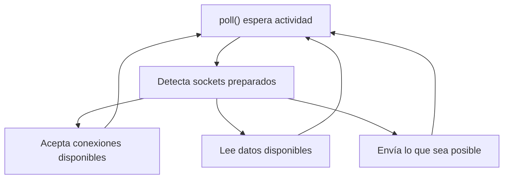

### Sockets no bloqueantes

```mermaid
flowchart TD
    Poll["poll() espera actividad"] --> Ready["Detecta sockets preparados"]
    Ready --> Accept["Acepta conexiones disponibles"]
    Ready --> Receive["Lee datos disponibles"]
    Ready --> Send["Envía lo que sea posible"]
    Receive --> Poll
    Send --> Poll
    Accept --> Poll
```