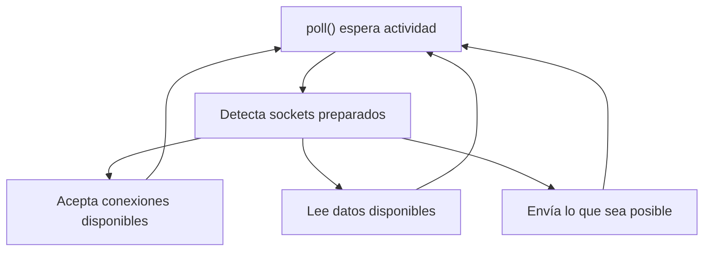

### Sockets no bloqueantes



### ¿Por qué tiene que ser no bloqueante?

Más adelante, el servidor utilizará `poll()` para gestionar varios clientes.

Si el socket fuese bloqueante, una llamada como:

`::accept(...);`

podría detener la ejecución hasta que apareciese una conexión. Durante ese tiempo, el servidor no podría atender correctamente otros eventos.

Con `O_NONBLOCK`, si no existe ninguna conexión pendiente, `accept()` devuelve inmediatamente `-1` y normalmente deja:

`errno == EAGAIN`

o:

`errno == EWOULDBLOCK`

Eso no representará un fallo grave, sino que simplemente significará: “ahora mismo no hay ninguna conexión que aceptar”.

---

`INADDR_ANY` significa que el servidor escuchará en todas las interfaces IPv4 disponibles. Esto incluye:

- `127.0.0.1`, para conexiones locales.
- La IP de la red local.
- Otras interfaces IPv4 presentes en el equipo.

Por eso se puede probar:

`nc 127.0.0.1 6667`

`INADDR_ANY` no es una IP a la que se conecte el cliente; es una instrucción para `bind()` equivalente a “acepta conexiones destinadas a cualquiera de mis direcciones IPv4”.

```cpp
serverAddress.sin_port = htons(
    static_cast<unsigned short>(port)
);
```

Asigna el puerto validado durante la fase 1.

`htons()` convierte un entero corto desde el orden de bytes del ordenador al orden utilizado por la red:

`host to network short`