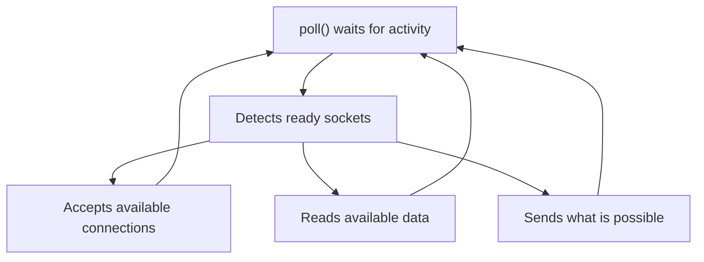

### Non-blocking sockets



### Why must it be non-blocking?

Later the server will use `poll()` to manage several clients.

If the socket were blocking, a call such as:

`::accept(...);`

could stop execution until a connection appeared. During that time the server could not handle other events correctly.

With `O_NONBLOCK`, if there is no pending connection, `accept()` returns immediately `-1` and normally leaves:

`errno == EAGAIN`

or:

`errno == EWOULDBLOCK`

That does not represent a serious failure; it simply means: “there is no connection to accept right now”.

---

`INADDR_ANY` means the server will listen on every available IPv4 interface. This includes:

- `127.0.0.1`, for local connections.
- The local network IP.
- Other IPv4 interfaces present on the machine.

That is why you can test with:

`nc 127.0.0.1 6667`

`INADDR_ANY` is not an IP the client connects to; it is an instruction for `bind()` equivalent to “accept connections destined for any of my IPv4 addresses”.

```cpp
serverAddress.sin_port = htons(
    static_cast<unsigned short>(port)
);
```

Assigns the port validated during phase 1.

`htons()` converts a short integer from the computer’s byte order to the order used by the network:

`host to network short`

`INADDR_ANY` accepts connections sent to any network interface on the computer (`0.0.0.0`), also depending on the firewall:

- 127.0.0.1
- The local network IP, such as 192.168.1.50
- Other IPs assigned to the machine

If you want to limit the server exclusively to the local machine:

```cpp
serverAddress.sin_addr.s_addr = htonl(INADDR_LOOPBACK);
```
---

`SO_REUSEADDR` is important to enable because it lets you restart your server and bind it to the same port immediately, without waiting for the operating system to fully release the previous connections.

The problem it avoids

When you close a TCP server, some connections may remain temporarily in the `TIME_WAIT` state. This is part of how TCP normally works: it prevents late packets from an old connection from interfering with a new one.

Without `SO_REUSEADDR`, after a quick restart:

`./ircserv 6667 password`

`bind()` might fail with:

`bind: Address already in use`

even though the previous server is no longer running.

With this option enabled:

```cpp
int reuseAddressOption = 1;

::setsockopt(
    listenSocket,
    SOL_SOCKET,
    SO_REUSEADDR,
    &reuseAddressOption,
    sizeof(reuseAddressOption)
);
```

the system allows the new socket to reuse that address and port.

### What it does not do

`SO_REUSEADDR` does not normally allow two servers to listen at the same time on the same address and port.

If you already have an active instance:

`./ircserv 6667 password`

and you run another:

`./ircserv 6667 password`

the second one should still fail in `bind()` because the first server still owns the port.

That is:

| Situation                               |      Without `SO_REUSEADDR` |              With `SO_REUSEADDR` |
| --------------------------------------- | --------------------------: | -------------------------------: |
| Restart the server quickly              |               May fail      |            Normally works        |
| Port occupied by another active server  |                      Fails  |                  Still fails     |
| Old connections in `TIME_WAIT`          |      May prevent `bind()`   | The port may be reused           |


It must not be confused with `SO_REUSEPORT`, which is related to allowing several sockets to use the same port under certain conditions.

### Why it is configured before `bind()`

The option affects the association of the socket with an address. That is why the order must be:

```text
socket()
    ↓
setsockopt(SO_REUSEADDR)
    ↓
bind()
    ↓
listen()
```

Enabling it after `bind()` would be too late: `bind()` may already have failed.

During `ft_irc` development the server must be stopped and restarted continuously. Without `SO_REUSEADDR`, you would have to wait before using port `6667` again, which would make testing very inconvenient.

---

#### `bind()`

Associates a socket with a local IP address and a specific port.

After the address is configured, `bind()` binds that address to the socket:

```cpp
bind(
    serverSocket,
    reinterpret_cast<struct sockaddr *>(&serverAddress),
    sizeof(serverAddress)
);
```

---

### listen()

```cpp
::listen(listenSocket, SOMAXCONN);
```

The second argument sets the limit of the pending-connection queue.

When a client tries to connect, the operating system can complete the TCP connection and leave it waiting in that queue until the server runs `accept()`.

```text
Client connects
        ↓
Pending connection in the queue
        ↓
accept() picks it up
```

`SOMAXCONN` requests the maximum pending connections allowed by the system. It does not represent:

- The total maximum number of clients of the server.
- The number of currently connected clients.
- A number of connections reserved in advance.
