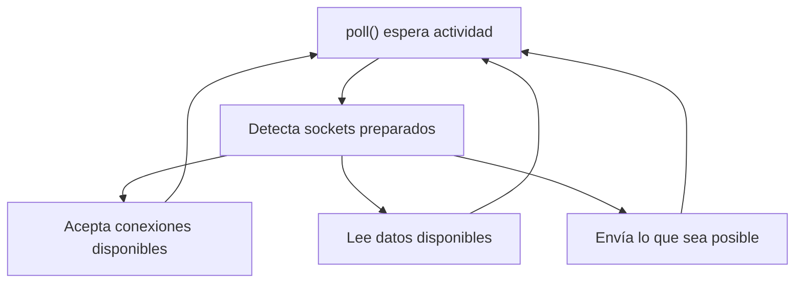

### Sockets no bloqueantes



### ¿Por qué tiene que ser no bloqueante?

Más adelante, el servidor utilizará `poll()` para gestionar varios clientes.

Si el socket fuese bloqueante, una llamada como:

`::accept(...);`

podría detener la ejecución hasta que apareciese una conexión. Durante ese tiempo, el servidor no podría atender correctamente otros eventos.

Con `O_NONBLOCK`, si no existe ninguna conexión pendiente, `accept()` devuelve inmediatamente `-1` y normalmente deja:

`errno == EAGAIN`

o:

`errno == EWOULDBLOCK`

Eso no representará un fallo grave, sino que simplemente significará: “ahora mismo no hay ninguna conexión que aceptar”.

---

`INADDR_ANY` significa que el servidor escuchará en todas las interfaces IPv4 disponibles. Esto incluye:

- `127.0.0.1`, para conexiones locales.
- La IP de la red local.
- Otras interfaces IPv4 presentes en el equipo.

Por eso se puede probar:

`nc 127.0.0.1 6667`

`INADDR_ANY` no es una IP a la que se conecte el cliente; es una instrucción para `bind()` equivalente a “acepta conexiones destinadas a cualquiera de mis direcciones IPv4”.

```cpp
serverAddress.sin_port = htons(
    static_cast<unsigned short>(port)
);
```

Asigna el puerto validado durante la fase 1.

`htons()` convierte un entero corto desde el orden de bytes del ordenador al orden utilizado por la red:

`host to network short`

`INADDR_ANY` acepta conexiones enviadas a cualquier interfaz de red del ordenador(`0.0.0.0`), dependiendo también del firewall:

- 127.0.0.1
- La IP de la red local, como 192.168.1.50
- Otras IP asignadas a la máquina

Si se quiere limitar el servidor exclusivamente al propio ordenador:

```cpp
serverAddress.sin_addr.s_addr = htonl(INADDR_LOOPBACK);
```
---

`SO_REUSEADDR` es importante activarlo porque permite reiniciar tu servidor y volver a asociarlo al mismo puerto inmediatamente, sin tener que esperar a que el sistema operativo libere por completo las conexiones anteriores.

El problema que evita

Cuando cierras un servidor TCP, algunas conexiones pueden permanecer temporalmente en estado `TIME_WAIT`. Esto es parte del funcionamiento normal de TCP: evita que paquetes atrasados de una conexión antigua interfieran con una conexión nueva.

Sin `SO_REUSEADDR`, al reiniciar rápidamente:

`./ircserv 6667 password`

`bind()` podría fallar con:

`bind: Address already in use`

aunque el servidor anterior ya no esté ejecutándose.

Con esta opción activada:

```cpp
int reuseAddressOption = 1;

::setsockopt(
    listenSocket,
    SOL_SOCKET,
    SO_REUSEADDR,
    &reuseAddressOption,
    sizeof(reuseAddressOption)
);
```

el sistema permite que el nuevo socket vuelva a utilizar esa dirección y ese puerto.

### Lo que no hace

`SO_REUSEADDR` no permite normalmente iniciar dos servidores escuchando simultáneamente en la misma dirección y el mismo puerto.

Si ya tienes una instancia activa:

`./ircserv 6667 password`

y ejecutas otra:

`./ircserv 6667 password`

la segunda debería seguir fallando en `bind()` porque el primer servidor todavía posee el puerto.

Es decir:

| Situación                               |      Sin `SO_REUSEADDR` |              Con `SO_REUSEADDR` |
| --------------------------------------- | ----------------------: | ------------------------------: |
| Reiniciar rápidamente el servidor       |            Puede fallar |            Normalmente funciona |
| Puerto ocupado por otro servidor activo |                   Falla |                  Sigue fallando |
| Conexiones antiguas en `TIME_WAIT`      | Pueden impedir `bind()` | Se permite reutilizar el puerto |


No debe confundirse con `SO_REUSEPORT`, que sí está relacionado con permitir que varios sockets utilicen el mismo puerto bajo determinadas condiciones.

### Por qué se configura antes de `bind()`

La opción afecta a la asociación del socket con una dirección. Por eso el orden debe ser:

```text
socket()
    ↓
setsockopt(SO_REUSEADDR)
    ↓
bind()
    ↓
listen()
```

Activarla después de `bind()` sería demasiado tarde: `bind()` ya podría haber fallado.

Durante el desarrollo de `ft_irc`, hay que detener y reiniciar el servidor continuamente. Sin `SO_REUSEADDR`, habría que esperar antes de volver a utilizar el puerto `6667`, lo que haría las pruebas muy incómodas.

---

#### `bind()`

Asocia un socket con una dirección IP local y un puerto concreto.

Después de configurar la dirección, `bind()` vincula esa dirección al socket:

```cpp
bind(
    serverSocket,
    reinterpret_cast<struct sockaddr *>(&serverAddress),
    sizeof(serverAddress)
);
```

---

### listen()

```cpp
::listen(listenSocket, SOMAXCONN);
```

El segundo argumento establece el límite de la cola de conexiones pendientes.

Cuando un cliente intenta conectarse, el sistema operativo puede completar la conexión TCP y dejarla esperando en esa cola hasta que el servidor ejecute `accept()`.

```text
Cliente se conecta
        ↓
Conexión pendiente en la cola
        ↓
accept() la recoge
```

`SOMAXCONN` solicita el máximo de conexiones pendientes permitido por el sistema. No representa:

- El máximo total de clientes del servidor.
- El número de clientes actualmente conectados.
- Un número de conexiones reservado de antemano.

